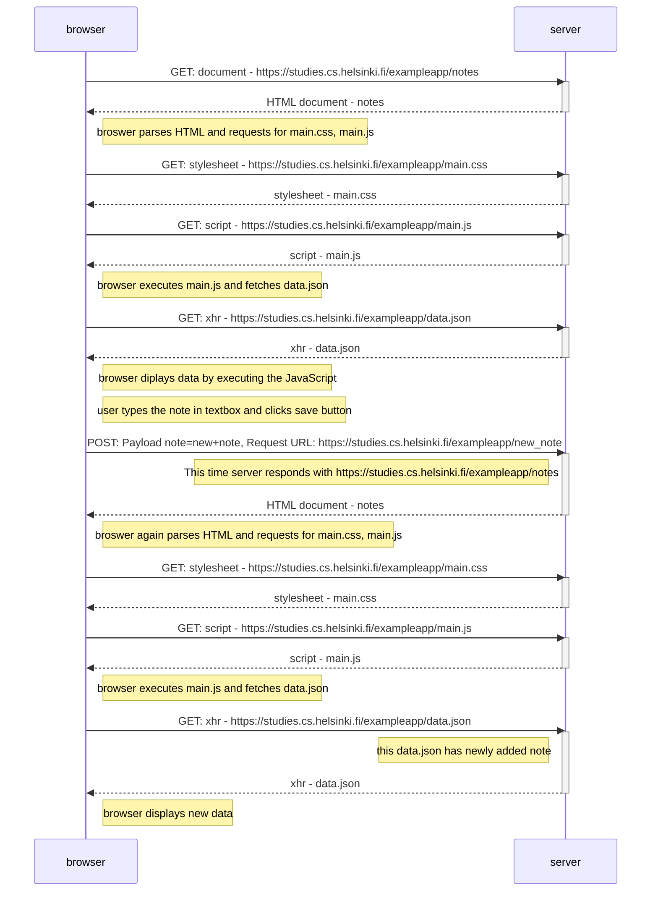

## New note sequence diagram 

```mermaid

sequenceDiagram

participant browser
participant server


browser->>server: GET: document - https://studies.cs.helsinki.fi/exampleapp/notes
activate server
server-->>browser: HTML document - notes
deactivate server

Note right of browser: broswer parses HTML and requests for main.css, main.js 

browser->>server: GET: stylesheet - https://studies.cs.helsinki.fi/exampleapp/main.css
activate server
server-->>browser: stylesheet - main.css
deactivate server

browser->>server: GET: script - https://studies.cs.helsinki.fi/exampleapp/main.js
activate server
server-->>browser: script - main.js
deactivate server

Note right of browser: browser executes main.js and fetches data.json

browser->>server: GET: xhr - https://studies.cs.helsinki.fi/exampleapp/data.json
activate server
server-->>browser: xhr - data.json
deactivate server

Note right of browser: browser diplays data by executing the JavaScript

Note right of browser: user types the note in textbox and clicks save button
browser->>server: POST: Payload note=new+note, Request URL: https://studies.cs.helsinki.fi/exampleapp/new_note
activate server
Note left of server: This time server responds with https://studies.cs.helsinki.fi/exampleapp/notes
server-->>browser: HTML document - notes
deactivate server


Note right of browser: broswer again parses HTML and requests for main.css, main.js 

browser->>server: GET: stylesheet - https://studies.cs.helsinki.fi/exampleapp/main.css
activate server
server-->>browser: stylesheet - main.css
deactivate server

browser->>server: GET: script - https://studies.cs.helsinki.fi/exampleapp/main.js
activate server
server-->>browser: script - main.js
deactivate server

Note right of browser: browser executes main.js and fetches data.json
browser->>server: GET: xhr - https://studies.cs.helsinki.fi/exampleapp/data.json
activate server
Note left of server: this data.json has newly added note
server-->>browser: xhr - data.json
deactivate server

Note right of browser: browser displays new data


```
