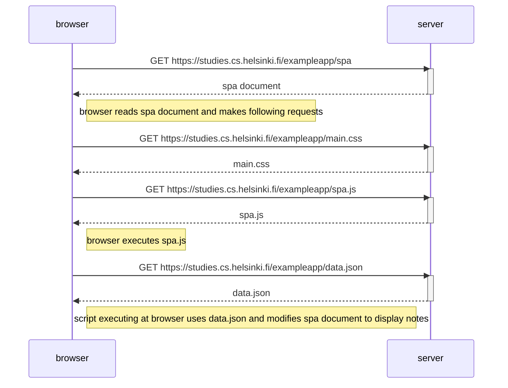

## Single page app diagram 

```mermaid

sequenceDiagram 

participant browser
participant server 

browser->>server: GET https://studies.cs.helsinki.fi/exampleapp/spa 
activate server
server-->>browser: spa document
deactivate server

Note right of browser: browser reads spa document and makes following requests
browser->>server: GET https://studies.cs.helsinki.fi/exampleapp/main.css
activate server
server-->>browser: main.css
deactivate server

browser->>server: GET https://studies.cs.helsinki.fi/exampleapp/spa.js
activate server
server-->>browser: spa.js
deactivate server

Note right of browser: browser executes spa.js

browser->>server: GET https://studies.cs.helsinki.fi/exampleapp/data.json
activate server
server-->>browser: data.json
deactivate server

Note right of browser: script executing at browser uses data.json and modifies spa document to display notes

```
